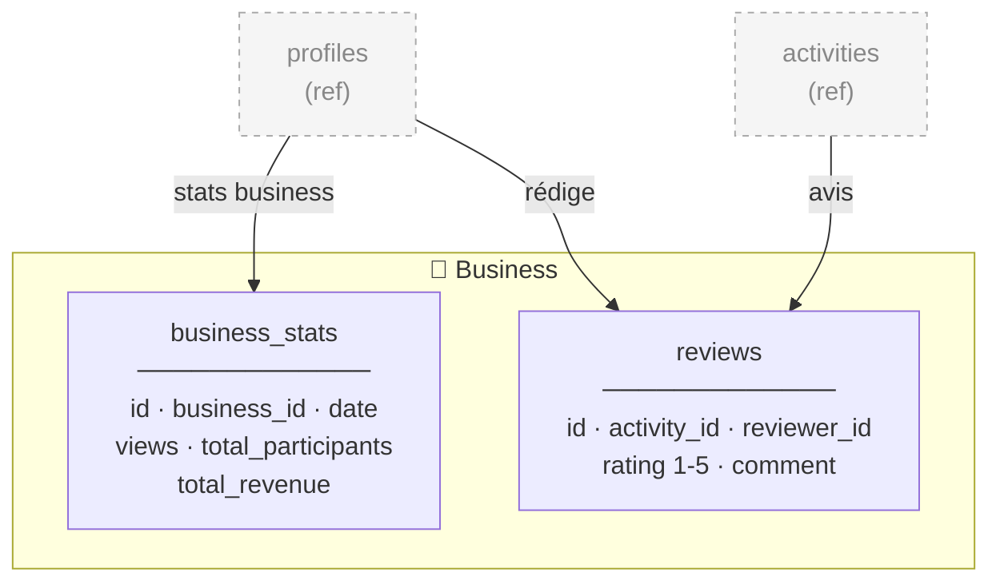
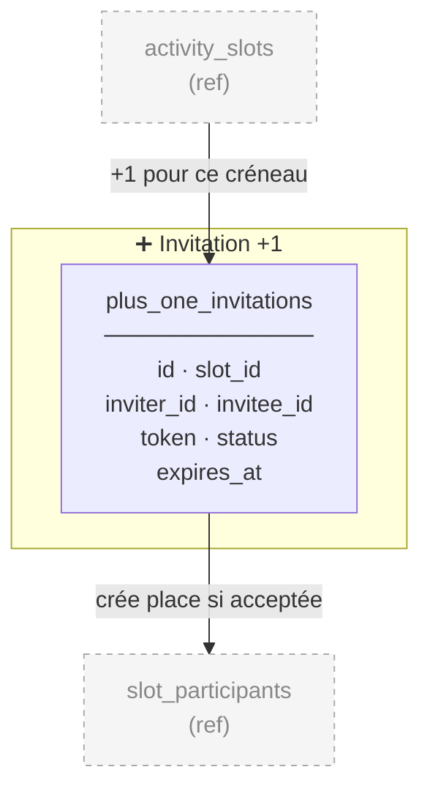
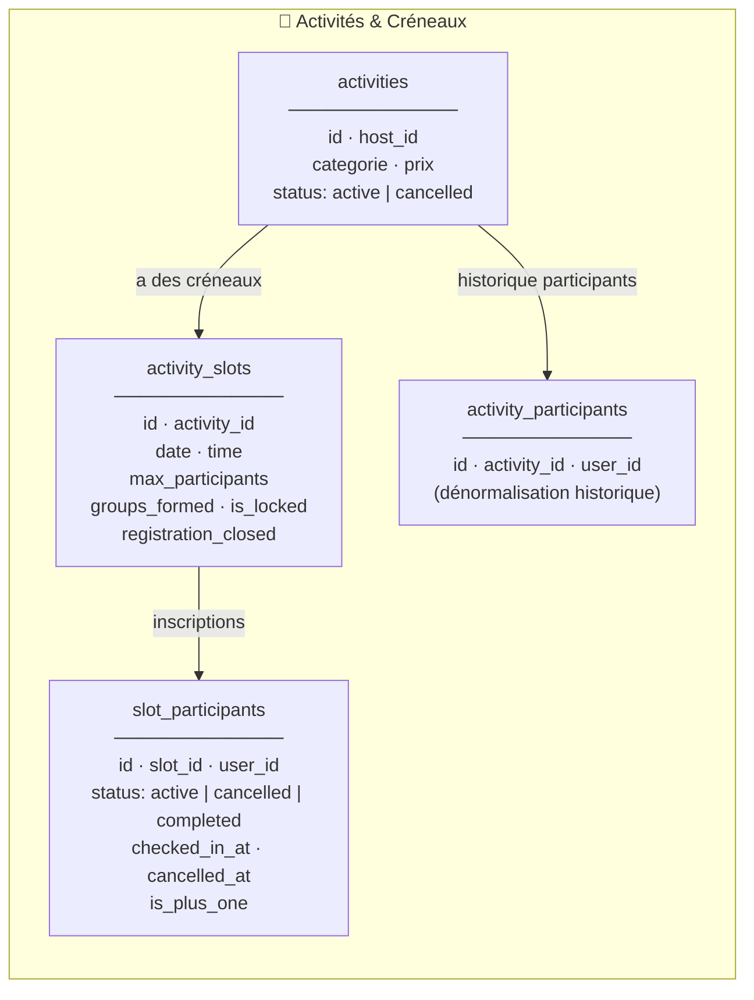

# Phase 0 — Corrections restantes

## Commande pour donner les permissions à cette session

```bash
sudo chown -R noa:noa /home/ubuntu/code_realmeet/diagrammes/
```

---

## 1. Diagrammes à modifier

### 1.1 `diagrammes/realmeet-user-flows.mermaid`

#### Flow 1 — Remplacer le subgraph FLOW1 complet par :

```mermaid
  subgraph FLOW1 ["Flow 1 — Inscription activite"]
    direction TB

    F1_START([Browse / Carte]):::user
    F1_START --> F1_SELECT[Selectionne activite + creneau]:::app

    F1_SELECT --> F1_CONFIRM["confirm-join<br/>Recap + prix indicatif<br/>+ regles no-show"]:::app

    F1_CONFIRM --> F1_RPC["RPC join_activity_slot<br/>Verifie ban / J-1 / capacite"]:::db
    F1_RPC -->|"Erreur"| F1_BLOCK[Inscription refusee<br/>ban / J-1 / complet / fermee]:::error
    F1_RPC -->|"OK"| F1_INSERT_SP["INSERT slot_participants<br/>status: active<br/>UPDATE activities participants + 1"]:::db

    F1_INSERT_SP --> F1_CONV_CHECK{"Conversation groupe<br/>existe ?"}:::app
    F1_CONV_CHECK -->|Oui| F1_JOIN_CONV["INSERT conversation_participants<br/>+ message systeme"]:::db
    F1_CONV_CHECK -->|Non| F1_CREATE_CONV["INSERT conversations is_group true<br/>+ participants"]:::db

    F1_JOIN_CONV --> F1_TRY_GROUPS
    F1_CREATE_CONV --> F1_TRY_GROUPS
    F1_TRY_GROUPS["checkAndFormGroupsIfNeeded"]:::app
    F1_TRY_GROUPS --> F1_DONE(["Inscription reussie"]):::check
  end
```

#### Flow 4 — Remplacer la ligne `F4_ACCEPT` :

**Ancien :**
```
    F4_ACCEPT["Guest accepte puis payment flow"]:::app
```
**Nouveau :**
```
    F4_ACCEPT["Guest accepte via confirm-join"]:::app
```

#### Ajouter Flow 6 — Détection no-show (après Flow 5, avant la fin du fichier) :

```mermaid
  %% ============================================================
  %% FLOW 6 — DETECTION NO-SHOW + PENALITES (added)
  %% ============================================================
  subgraph FLOW6 ["Flow 6 — Detection no-show + penalites"]
    direction TB

    F6_CRON(["pg_cron toutes les heures"]):::cron
    F6_CRON --> F6_CALL["RPC detect_no_shows"]:::db

    F6_CALL --> F6_FIND["SELECT slot_participants<br/>status active + checked_in_at NULL<br/>slot termine depuis 1h+<br/>pas de penalty existante"]:::db

    F6_FIND --> F6_LOOP{"Pour chaque no-show"}:::app
    F6_LOOP --> F6_PENALTY["INSERT user_penalties<br/>type: no_show"]:::db
    F6_PENALTY --> F6_INC["UPDATE profiles<br/>penalty_count + 1"]:::db

    F6_INC --> F6_BAN_CHECK{"penalty_count >= 2 ?"}:::app
    F6_BAN_CHECK -->|Non| F6_COMPLETE["UPDATE slot_participants<br/>status: completed"]:::db
    F6_BAN_CHECK -->|Oui| F6_BAN["UPDATE profiles is_banned = true<br/>INSERT banned_phones"]:::db
    F6_BAN --> F6_COMPLETE

    F6_COMPLETE --> F6_LOOP
    F6_LOOP -->|Tous traites| F6_ALSO["Aussi : marque les checked-in<br/>comme completed"]:::db
    F6_ALSO --> F6_DONE(["No-shows traites"]):::check
  end
```

---

### 1.2 `diagrammes/realmeet-domain-flow.mermaid`

#### Remplacer la section PAYMENT par PENALTY :

**Supprimer :**
```
  PAYMENT[Paiement]:::payment
  PAYMENT --- PAY_F1[Flow multi-etapes · methode · carte · confirmation]:::done
  PAYMENT --- PAY_F2["Preview carte bancaire à supprimer"]:::done
  PAYMENT --- PAY_F3["Integration Stripe A supprimer"]:::wip
  PAYMENT --- PAY_F4[Bypass dev temporaire]:::done
  PAYMENT --- PAY_F5["Paiement duo · host_pays / guest_pays A supprimer"]:::done
  PAYMENT --- PAY_F6[Reservation 10 min pour duo]:::done
```

**Remplacer par :**
```
  PENALTY[Penalites no-show]:::payment
  PENALTY --- PEN_F1[Detection automatique no-show · pg_cron 1h]:::done
  PENALTY --- PEN_F2[user_penalties · historique penalites]:::done
  PENALTY --- PEN_F3[Bannissement auto · 2 no-shows]:::done
  PENALTY --- PEN_F4[banned_phones · blocage par telephone]:::done
  PENALTY --- PEN_F5[Verification ban a l inscription]:::done
  PENALTY --- PEN_F6[Verification ban au login]:::done
```

#### Remplacer les relations :
```
  ACTIVITIES ==>|inscription| PAYMENT
```
par :
```
  ACTIVITIES ==>|presence| PENALTY
```

Supprimer :
```
  PLUSONE ==>|paiement duo| PAYMENT
```

Remplacer :
```
  BUSINESS --- BIZ_F7[Revenue tracking · activity_revenue]:::done
```
par :
```
  BUSINESS --- BIZ_F7[Revenue tracking]:::planned
```

---

### 1.3 `diagrammes/realmeet-erd.md`

#### Dans le subgraph PLUS "➕ Invitation +1", remplacer :
```
    POI["plus_one_invitations\n─────────────\nid · slot_id\ninviter_id · invitee_id\ntoken · status\npayment_mode\nexpires_at"]
```
par :
```
    POI["plus_one_invitations\n─────────────\nid · slot_id\ninviter_id · invitee_id\ntoken · status\nexpires_at"]
```

#### Dans le subgraph BIZ "🏢 Business & Paiement", supprimer activity_revenue et ajouter penalty tables :

**Remplacer :**
```
  subgraph BIZ["🏢 Business & Paiement"]
    direction TB
    BS["business_stats\n─────────────\nid · business_id · date\nviews · total_participants\ntotal_revenue"]
    AR["activity_revenue\n─────────────\nid · activity_id\nbusiness_id · participant_id\namount · payment_status"]
    RV["reviews\n─────────────\nid · activity_id · reviewer_id\nrating 1-5 · comment"]
  end
```
par :
```
  subgraph BIZ["🏢 Business"]
    direction TB
    BS["business_stats\n─────────────\nid · business_id · date\nviews · total_participants\ntotal_revenue"]
    RV["reviews\n─────────────\nid · activity_id · reviewer_id\nrating 1-5 · comment"]
  end

  %% ─── PENALITES ────────────────────────────────────────────────
  subgraph PEN["⚠️ Penalites"]
    direction TB
    UP["user_penalties\n─────────────\nid · user_id\nslot_participant_id\npenalty_type: no_show\ncreated_at"]
    BP["banned_phones\n─────────────\nid · phone\nbanned_at · reason"]
  end
```

#### Dans le subgraph ACT, modifier slot_participants pour ajouter cancelled_at :
```
    SP["slot_participants\n─────────────\nid · slot_id · user_id\nstatus: active | cancelled | completed\nchecked_in_at · cancelled_at\nis_plus_one"]
```

#### Dans le subgraph AUTH, modifier profiles pour ajouter penalty_count et is_banned :
```
    P["profiles\n─────────────\nid · username · full_name\naccount_type · intention\ninterests · personality_tags\nexpo_push_token\npenalty_count · is_banned"]
```

#### Supprimer les relations activity_revenue :
- Supprimer : `P -->|"revenus business"| AR`
- Supprimer : `A -->|"revenus"| AR`

#### Ajouter les relations pénalités :
```
  P -->|"penalites"| UP
  SP -->|"no-show detecte"| UP
```

#### Dans la section "Statuts importants", ajouter la ligne :
```
| `slot_participants` | `status` | `active`, `cancelled`, `completed` |
```
(remplacer la ligne existante)

---

### 1.4 `diagrammes/domains/business-payment.mermaid`

**Supprimer activity_revenue.** Nouveau contenu :



---

### 1.5 `diagrammes/domains/plus-one.mermaid`

**Supprimer payment_mode.** Nouveau contenu :



---

### 1.6 `diagrammes/domains/activities-slots.mermaid`

**Ajouter cancelled_at à slot_participants.** Nouveau contenu :



---

## 2. Modifications CLAUDE.md

### Section "Architecture des 5 flows critiques" → Flow 1

**Remplacer :**
```
### Flow 1 — Inscription activité + Paiement
`browse → activity-detail → payment/select-method → card-form → confirmation → INSERT slot_participants → conversation groupe`
```
**Par :**
```
### Flow 1 — Inscription activité
`browse → activity-detail → confirm-join → RPC join_activity_slot → INSERT slot_participants → conversation groupe`
```

### Section "RPC principales" — Ajouter ces lignes au tableau :

```
| `join_activity_slot` | slot_participants, activities, profiles | Inscription à un créneau (vérifie ban, J-1, capacité) |
| `cancel_slot_participation` | slot_participants, activities | Annulation de participation (soft delete + late_cancel) |
| `detect_no_shows` | slot_participants, user_penalties, profiles, banned_phones | Détection no-shows + pénalités + bannissement |
| `check_phone_banned` | banned_phones | Vérifie si un numéro est banni |
```

---

## 3. Résumé de ce qui a été fait

### Migrations appliquées (11) :
1. `drop_activity_revenue` — table supprimée
2. `drop_payment_mode_from_plus_one` — colonne supprimée
3. `add_penalty_columns_to_profiles` — penalty_count + is_banned ajoutés
4. `create_user_penalties` — table + index + RLS + policy
5. `create_banned_phones` — table + RLS
6. `add_cancelled_at_to_slot_participants` — colonne ajoutée
7. `update_validate_plus_one_token` — payment_mode retiré du JSON
8. `create_join_activity_slot_rpc` — nouvelle RPC SECURITY DEFINER
9. `create_cancel_slot_participation_rpc` — nouvelle RPC SECURITY DEFINER
10. `create_detect_no_shows_and_cron` — RPC + pg_cron toutes les heures
11. `create_check_phone_banned_rpc` — nouvelle RPC

### Types TypeScript :
- `lib/database.types.ts` — regénéré avec les nouvelles tables/colonnes/RPCs

### Fichiers app modifiés :
- `app/payment/` — **supprimé** (4 fichiers)
- `app/confirm-join.tsx` — **créé** (nouvel écran de confirmation)
- `app/activity-detail.tsx` — navigation vers confirm-join + désinscription via RPC
- `app/invite/[token].tsx` — navigation vers confirm-join + suppression paymentMode
- `services/invitation.service.ts` — suppression paymentMode des interfaces/mappings
- `services/auth.service.ts` — vérification is_banned après login
- `services/phone-verification.service.ts` — vérification phone banni avant OTP

### Reste à faire :
- Appliquer les corrections de diagrammes (ci-dessus)
- Mettre à jour CLAUDE.md (Flow 1 + table RPC)
- Créer/mettre à jour `contexte/task_plan.md` avec Phase 0 terminée
