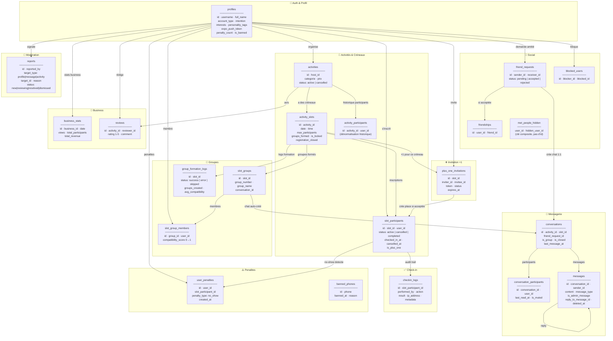

# RealMeet — Modèle de données

> **Pour Claude Code** : Ce fichier donne une vue macro. Pour le schéma complet (colonnes exactes, types, contraintes, index), utilise les outils MCP Supabase (`list_tables`, `execute_sql`, `generate_typescript_types`).

---

## 1. Diagramme complet



---

## 2. Règles data

### Identifiants & clés
- Toutes les PKs sont `uuid` généré par `gen_random_uuid()`
- `profiles.id` = même UUID que `auth.users.id` (pas de FK déclarée, synchronisé via trigger)
- Unicités déclarées : `profiles.username`, `slot_participants.checkin_nonce`, `plus_one_invitations.token`

### Suppression
- **Soft delete partout** sur les données utilisateur : `status = 'cancelled'` ou `deleted_at`
- Exception : `met_people_hidden` — suppression physique OK
- Jamais de `DELETE` direct côté client

### Sécurité
- **RLS activé** sur toutes les tables
- Tout INSERT/UPDATE sensible passe par une **RPC `SECURITY DEFINER`** qui vérifie `auth.uid()` en interne
- Jamais de mutation directe depuis le client sur les tables sensibles

### Timezones
- PostgreSQL stocke tout en **UTC** (`timestamptz`)
- Logique métier (groupes, check-in) convertit en **`Europe/Paris`**
- `pg_cron` tourne en UTC → les RPC font la conversion

### Statuts importants
| Table | Colonne | Valeurs |
|-------|---------|---------|
| `activities` | `status` | `active`, `cancelled` |
| `activity_slots` | `is_locked`, `is_cancelled`, `registration_closed`, `groups_formed` | booleans |
| `slot_participants` | `status` | `active`, `cancelled`, `completed` |
| `plus_one_invitations` | `status` | `pending`, `accepted`, `expired`, `cancelled` |
| `messages` | `message_type` | `text`, `image`, `voice`, `system` |
| `friend_requests` | `status` | `pending`, `accepted`, `rejected` |
| `checkin_logs` | `action` | `token_generated`, `scan`, `validate`, `reject`, `expire` |

### Conversations — 3 types
| Type | `is_group` | `activity_id` | `friend_request_id` |
|------|-----------|--------------|-------------------|
| Chat de groupe (slot) | `true` | ✓ | null |
| Chat 1:1 ami | `false` | null | ✓ |
| Chat futur / autre | — | — | — |

---

## 3. Pour aller plus loin

**Ce fichier est intentionnellement macro.** Pour les détails exacts :

```
→ Colonnes complètes      : MCP Supabase → list_tables(verbose: true)
→ Types PostgreSQL exacts : MCP Supabase → generate_typescript_types
→ Index & contraintes     : MCP Supabase → execute_sql("SELECT ...")
→ Migrations appliquées   : MCP Supabase → list_migrations
→ Logs & erreurs runtime  : MCP Supabase → get_logs(service)
```
